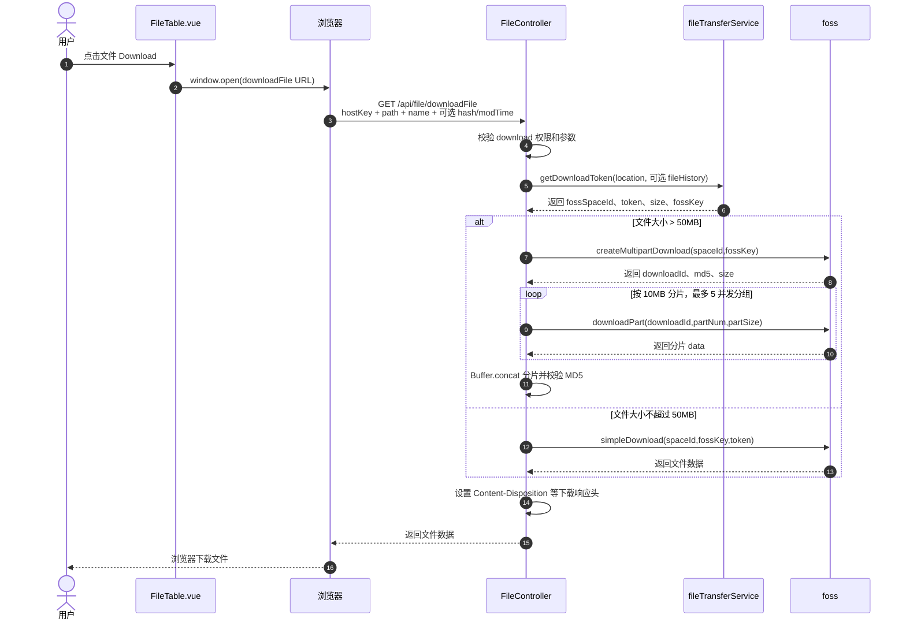
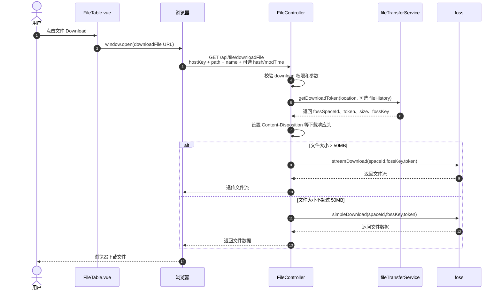
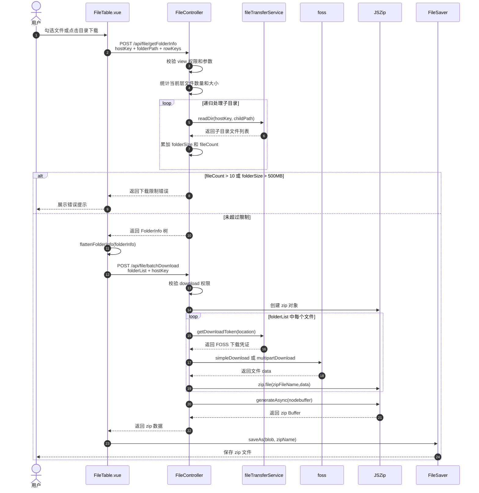
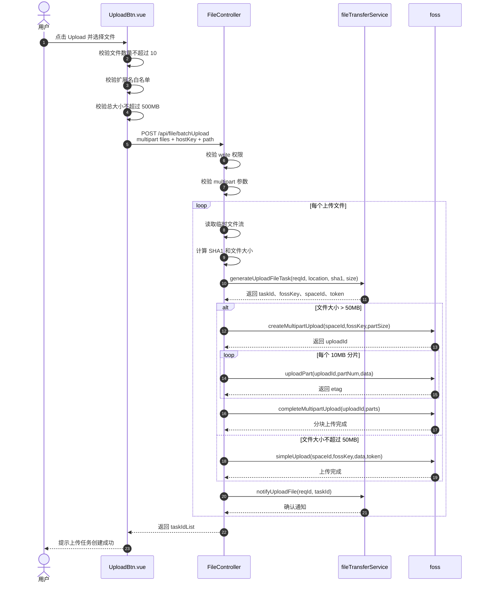
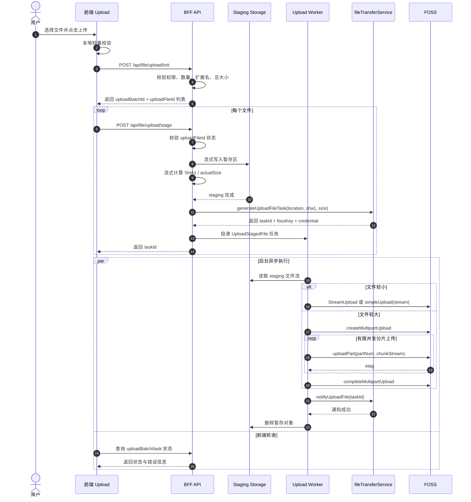

## 业务背景

富途的业务同事需要从多个上游券商获取文件，但是不同上游各自有各自的中台系统，比较分散，缺少一个统一的文件管理中台

## 文章定位

本文重点在于复盘文件中台场景下的几个关键架构决策，而不是一一列举介绍项目的所有功能。考虑到这是一个 3 年前的旧项目，很多实现要受当时下游能力和交付节奏限制。文中的后续优化，部分是已落地演进，部分是复盘后的理想方向。

## 技术栈

项目选用当时普遍的 Vue 3 + Ant Design Vue、Egg.js、TypeScript、Protobuf.js，这也是富途内部最常用的后台技术栈

这个项目不是传统的前端 CRUD，而是 BFF 编排层，核心在于基于 Egg.js 的 BFF 层逻辑，通过 Protobuf.js 对接 3 个下游服务：

1. **FOSS**: 文件管理，上传，下载，分块传输
2. **fileTransferService**：负责业务文件能力，对接文件上传，刷新，文件夹创建任务
3. **uFTConsoleService**：任务管理，查询，重试，停止，查询任务日志

对比传统的 REST API，Protobuf 有以下优势：

1. Protobuf 文件提前定义好：服务名、方法名、请求结构、返回结构，不会出现接口文档跟实际调用不一致的情况
2. Protobuf 不传 JSON 文本，请求和响应都是按 Protobuf 的二进制协议编码，体积小，解析成本低，传输速度快
3. 采用 gRPC 传输，底层是 HTTP/2，可以实现多路传输，速度更快
4. 对于文件中台管理项目，Protobuf 协议在传输文件的时候以 bytes 直接进行二进制内容传输，而 REST + JSON 还需要对文件转换成 Base64 字符串

BFF 可以直接调用 Protobuf 文件自动生成的服务，通过 `ctx.service.xxx` 类似的格式进行调用

```JavaScript
await ctx.service.fileTransferService.notifyUploadFile({
  reqId: ctx.helper.requestId(),
  taskId,
});

const completeUploadRes = await ctx.service.foss.completeMultipartUpload(
    {
      uploadId,
      parts: uploadResList,
    },
    fossOption
  );
```

## 整体架构设计

### UI 层

File 页面，负责展示不同上游的文件，并提供对应操作

1. 横向 Tab 展示上游列表，点击切换上游，同时切换下方的文件列表
2. **文件列表**作为核心模块，分行展示文件和文件夹，包含以下元数据：文件名、大小、文件地址，右侧操作列支持：下载、删除、查看文件历史操作
3. 筛选支持全局筛选和本地筛选，以及按文件状态筛选


Task 页面，用于文件删除、创建、同步等任务的状态管理


### 单文件下载

#### **1.0 流程**

当时下游 FOSS 服务还没有成熟的流式下载能力，BFF 只能先承担下载拼接职责。

1. 用户点击文件行的 Download。
2. 前端打开下载 URL：`/api/file/downloadFile?hostKey=...&path=...&name=...`。
3. 服务端根据上游 hostKey 校验 `download` 权限。
4. 服务端调用 `fileTransferService.getDownloadToken` 获取 FOSS 下载凭证。
   1. 若文件小于等于 50MB，调用 `foss.simpleDownload`。
   2. 若文件超过 50MB，调用 `foss.createMultipartDownload` 后分片下载，并做 MD5 校验。
5. 服务端设置下载响应头，把文件数据返回浏览器。

```JavaScript
ctx.set({
  'Content-Length': data.length + '',
  'Content-Type': 'application/force-download',
  'Content-Disposition': `attachment; filename=${encodeURIComponent(query.name)}`,
  'Cache-Control': 'no-cache',
});
```

同时支持文件的历史版本下载，在这个流程中（获取 downloadToken）时额外传入 `hash` 和 `modTime`，由下载 token 请求中的 `fileHistory` 指定目标版本。



#### **痛点：BFF 层吃进整块文件内存**

对于小文件下载，这个流程没有什么问题，但是大文件下载的话当前请求会把所有分片都放在内存里，**然后 Buffer.concat 合并成完整文件**。

如果一个文件 500MB，同时 5 个用户下载，服务端内存压力会很明显。

#### **演进方案：小文件直下，大文件流下载**

下游文件存储服务 FOSS 后续开始支持流下载传输，对于大文件可以不再处理分块拼接，而是直接用流传输的方式，通过一个请求完成下载。

设计后的新流程如下：对比原流程，UI 层和 BFF 层鉴权逻辑不改，大小文件处理逻辑改为：小文件直下，大文件流式处理。

1. 用户在 UI 层点击下载链接触发下载请求，BFF 层校验 `download` 权限。
2. 服务端调用 `fileTransferService.getDownloadToken` 获取 FOSS 下载凭证。
   1. 若文件小于等于 50MB，调用 `foss.simpleDownload`。
   2. 若文件超过 50MB，调用 `foss.streamDownload` 返回流数据。
3. 服务端设置下载响应头，把文件数据返回浏览器。




```JavaScript
const stream = await ctx.service.foss.streamDownload(
  { spaceId: fossSpaceId, filename: fossKey },
  {
    timeout: FOSS_TIMEOUT,
    srpcHeaders: {
      customizedHeader: { 'X-Foss-Token': token },
    },
  }
);

ctx.body = stream;
```

#### **收益**

1. 减少并发请求数，单个大文件现在同样是单个请求。
2. 减少了需要设计分块请求并发的系统复杂度。
3. 减少服务器的内存压力，现在文件不会分块下载好后再拼起来堆到内存中，而是按照流格式输出到前端。

### 批量文件下载

包含多文件下载和文件夹下载。

#### **1.0 流程**

第一版目标是先快速交付可用能力，因此优先采用同步打包方案。

1. 用户勾选多个文件/文件夹，或点击目录下载。
2. 前端调用 `/api/file/getFolderInfo`，提交当前 `folderPath`、`hostKey` 和选中项。
3. 服务端递归读取目录内容，统计文件数量和总大小。
4. 若超过 10 个文件或 500MB，服务端直接报错。
5. 前端把服务端返回的树形目录信息扁平化为 `folderList`。
6. 前端调用 `/api/file/batchDownload`。
7. 服务端对每个文件申请下载 token 并从 FOSS 拉取内容。
8. 服务端用 JSZip 生成 ZIP。
9. 前端把返回的 Buffer 转成 Blob，并用 FileSaver 保存。



#### **痛点：同步请求责任太重**

之前的实现是用「前端先预检文件树 + 后端统一打 ZIP」的方式，快速交付一个可用的多文件下载能力。

多个小文件下载不会有问题，但是遇到总文件体量大的情况，就会出现跟大文件下载一样的内存问题。

而且当前批量下载按照同步请求处理是核心问题，它把以下功能都堆在一次同步请求里了：

- 目录展开
- 资源校验
- 文件拉取
- 压缩打包
- 响应输出

批量文件下载**本质上就是长耗时操作**，把它的全流程塞进一个 HTTP 请求里，超时、内存峰值、失败恢复都很差，更适合按照异步任务设计执行。

#### **演进方案：同步改异步 + 临时对象存储 + Worker 承担下载**

本次改动不仅需要 OSS 服务的流式输出支持，还需要 `fileTransferService` 支持将批量下载操作一并纳入任务体系。

主要改动：

1. 任务模式：首先**把「同步大请求」改成「异步任务」**
   1. 用户体验由原来的「点击打包后等待结果；如果打包失败，则需要重新跑完整链路」
   2. 改为：「已开始打包」「打包完成，可下载」「失败，可重试」「可重复下载」
2. **校验层面：让后端自己展开目录，不信前端传完整结构**
3. 打包工具：ZIP 打包器改为支持流式输出的 Archiver，避免内存峰值过高
4. **下载结果存储：下载结果写到临时对象存储，而不是 API 直接回传**

新流程可分为两个阶段：创建任务和后台执行。

**创建任务**

1. 用户发起批量下载操作。
2. BFF 层进行下载文件的参数校验和 `hostKey-download` 权限校验。
3. 根据 `rowKeys` 展开真实文件清单。
4. 服务端执行最终兜底校验，计算：
   - 文件总数
   - 总大小
   - 每个文件真实路径
5. 如果失败，返回结果。
6. 如果成功，则生成下载任务。
7. 将任务投递给后台 Worker。

```mermaid
sequenceDiagram
    participant User as 用户
    participant FE as 前端文件页
    participant API as API 服务
    participant Task as 任务系统
    participant FT as fileTransferService

    User->>FE: 选择文件/目录并点击 Batch Download
    FE->>API: POST /api/file/createBatchDownloadTask
    API->>API: 校验参数与 download 权限
    API->>FT: 递归展开目录与获取真实文件清单
    FT-->>API: 返回文件树和文件元信息
    API->>API: 计算 fileCount / totalSize / 目录结构
    alt 超出限制
        API-->>FE: 返回校验失败
    else 校验通过
        API->>Task: 创建 TASK_TYPE_BATCH_DOWNLOAD
        Task-->>API: 返回 taskId
        API-->>FE: 返回 taskId
    end
````


后台 Worker 接手：

1. 主动轮询检查有无待执行的批量下载任务：`fileTransferService.getWaitingTask`。
2. 领取任务，获取下载任务细节：为每个文件申请下载 token。
   1. 小文件优先走流式下载。
   2. 大文件优先使用下游已有 `streamDownload` 能力。
3. 文件流直接 append 到 ZIP 流。
4. ZIP 流直接写入 FOSS 的临时对象存储。
5. 打包完成后写回任务结果，更新任务状态。
6. 用户在 Task 界面下载生成好的 ZIP 包。

```mermaid
sequenceDiagram
    participant Worker as 下载 Worker
    participant FT as fileTransferService
    participant FOSS as 对象存储/FOSS
    participant Task as 任务系统
    participant FE as 前端
    participant Browser as 浏览器

    Worker->>Task: 轮询领取 batch download 任务
    Worker->>Worker: 初始化 zip 流和并发控制器
    loop 遍历文件清单
        Worker->>FT: 获取单文件下载 token
        FT-->>Worker: token + fossKey + size
        Worker->>FOSS: 以 streamDownload/流式方式拉取文件
        FOSS-->>Worker: 文件流
        Worker->>Worker: append 到 zip stream
    end
    Worker->>FOSS: 将 zip stream 写入临时存储
    FOSS-->>Worker: 返回结果位置 zipFossKey
    Worker->>Task: 更新任务为 SUCCESS，写入 downloadUrl / expiredAt

    FE->>Task: 轮询任务状态
    Task-->>FE: SUCCESS + downloadUrl
    FE->>Browser: 触发下载
    Browser->>FOSS: 请求最终 zip
    FOSS-->>Browser: 返回 zip 文件流
```


Worker 执行的 demo 代码如下：

```JavaScript
// worker/batchDownloadWorker.ts
import archiver from 'archiver';
import { PassThrough } from 'node:stream';

async function runWorker(app) {
  const opaque = `batch-worker-${process.pid}`;
  const hostKey = 'your-host-key';

  // 1. 抢 host 级别锁，避免多个 worker 同时处理同一 hostKey 的任务
  await app.fileTransferService.agentLock({
    hostKey,
    expiry: '10m',
    opaque,
  });

  try {
    while (true) {
      // 2. 拉取待处理任务
      const { task } = await app.fileTransferService.getWaitingTask({ hostKey });

      if (!task?.taskId) {
        await sleep(3000);
        continue;
      }

      const taskId = task.taskId;

      try {
        // 3. 标记任务开始
        await app.fileTransferService.taskStart({
          reqId: genReqId(),
          taskId,
          currentNode: 1,
        });

        // 4. 查询任务详情
        const detail = await app.fileTransferService.getBatchDownloadTask({ taskId });

        // 5. 执行打包
        const result = await buildZipAndUpload(app, detail);

        // 6. 上传结果到 foss
        await this._uploadFile({ hostKey, path, result })

        // 7. 标记任务成功
        await app.fileTransferService.taskSuccess({
          reqId: genReqId(),
          taskId,
          currentNode: 1,
        });
      } catch (err: any) {
        await app.fileTransferService.taskFailed({
          reqId: genReqId(),
          taskId,
          currentNode: 1,
          reason: err.message || 'batch download failed',
        });
      }
    }
  } finally {
    await app.fileTransferService.agentUnlock({ hostKey, opaque });
  }
}
```

#### **收益**

1. 将“用户发起批量下载”和“用户真正下载 ZIP 产物”这两个动作解耦，避免把目录展开、文件拉取、压缩打包、结果回传全部堆在一次 HTTP 请求里，显著缩短单次请求时间。
2. 将批量下载正式纳入任务体系后，任务状态可追踪、失败可重试，用户不需要因为一次打包失败就重新跑完整链路。
3. ZIP 产物写入临时对象存储后，下载结果可以被重复获取，用户不必长时间停留在当前页面等待打包完成，整体体验更稳定。
4. 对服务端来说，原来集中在同步请求里的超时压力、内存峰值和失败恢复问题被拆散到异步 Worker 和对象存储链路中，系统更容易治理和扩展。


#### **更理想的演进方向**

当前的实现更多是站在 File Interaction 项目自身的角度来承接这项功能。虽然已经借助了下游服务的支持，但仍然可以更进一步。

现在批量下载流程中的文件打包依旧挂在 BFF 体系里：前端 → BFF 创建任务，BFF 自己的 Worker 去拉文件、打 ZIP、传 FOSS。

这样只是把同步请求改成异步任务，打包压力仍然属于 BFF 这一层。

可是如果批量下载的打包与产物管理能力**改成由下游的** **`fileTransferService`** **服务实现**，将复杂度转移，那么 BFF 可以只保留控制面职责，整体上对本项目会省力很多。

尤其是 `fileTransferService` 已经包含以下特征：

- 它对接 Task 任务中心，已支持创建、上传、删除、同步等任务
- 它天然知道文件位置和文件元数据
- 以后不止这个 BFF 会用到批量下载能力，可以被其他文件后台系统使用

真正合理的架构设计，一定不是只会往一个项目里堆复杂度，而是从整个系统层面出发，看怎样分配复杂度最合理。

### 上传

#### **1.0 流程**

当时还没有围绕上传暂存区和异步分发建立完整的 Worker 执行链路，所以先沿用同步上传链路。

1. 用户点击 Upload 按钮，选择一个或多个文件。
2. 前端校验文件数量、扩展名和总大小。
3. 前端通过 multipart POST 到 `/api/file/batchUpload`，同时提交 `hostKey` 和 `path`。
4. 服务端校验 `write` 权限和参数。
5. 服务端读取每个临时文件，计算 SHA-1。
6. 服务端调用 `fileTransferService.generateUploadFileTask` 创建上传任务，并拿到 FOSS key、`spaceId`、token。
   1. 若文件小于等于 50MB，调用 `foss.simpleUpload`。
   2. 若文件超过 50MB，则需要进行分块处理，调用 `foss.createMultipartUpload`、`foss.uploadPart`、`foss.completeMultipartUpload`。
7. FOSS 上传完成后，服务端调用 `fileTransferService.notifyUploadFile`，通知上游系统。
8. 前端提示上传任务创建成功，后续通过任务状态或列表刷新观察结果。




#### **痛点：请求链路过长，内存容易占用过高**

1.0 上传操作的实现问题跟批量下载类似：

- 一次请求链路过长：
  - 前端通过 multipart 把文件传给 BFF。
  - BFF 读取临时文件流，并把内容不断 Buffer.concat 到 content。
  - BFF 再把整块 content 上传到 FOSS。
  - 上传成功后调用 `notifyUploadFile`。
- 内存容易占用过高：整块文件上传时都会被聚合到内存中，多个大文件同时上传内存占用率极高，很容易造成服务瘫痪。

#### **演进方案：同步改异步 + 引入暂存区 + Worker 承担上传任务**

重新设计时需要引入文件**暂存区：也就是前端上传到 BFF 层后，BFF 不直接上传给 FOSS 文件存储服务，而是先存在服务器的暂存区上，后续由 Worker 分发**。

把上传链路拆成三段：

1. **Init**
   前端先声明本次上传的元信息，服务端完成权限和规则校验，创建 `uploadBatchId` 与 `uploadFileId`。
2. **Stage**
   前端把文件上传到 BFF 的 staging 接口，BFF 以流式方式写入共享暂存区，并在写入过程中计算 SHA-1、统计大小。
3. **Transfer**
   staging 完成后，服务端创建正式上传任务，并由异步 Worker 从暂存区流式上传到 FOSS，最后调用 `notifyUploadFile`。

新流程可以分为两个阶段：

**第一阶段：上传到暂存区**

1. 用户在前端点击 Upload，选择文件。
2. 前端先做一轮轻量校验，例如文件数量、扩展名。
3. 前端调用 `POST /api/file/upload/init`，服务端校验上传权限、文件数量、扩展名和总大小，并返回 `uploadBatchId` 和每个文件对应的 `uploadFileId`。
4. 前端按文件逐个调用 `POST /api/file/upload/stage`。
5. BFF 先校验 `uploadFileId` 当前状态，然后将文件流式写入 staging 暂存区，并在写入过程中同步计算 SHA-1 和实际大小。
6. staging 完成后，BFF 调用 `fileTransferService.generateUploadFileTask(location, sha1, size)` 创建正式上传任务，拿到 `taskId` 等信息。
7. BFF 投递异步 Worker 任务，并把 `taskId` 返回给前端。

**第二阶段：后台异步上传到正式存储**

1. Node Worker 在后台从 staging 区读取文件流。
2. 小文件直接走 `StreamUpload` 或 `simpleUpload(stream)`。
3. 大文件走 multipart 分片上传：先创建 multipart upload，再并发上传各个分片，最后调用 `completeMultipartUpload`。
4. 正式上传完成后，Worker 调用 `notifyUploadFile(taskId)` 通知上游。
5. 通知成功后，再删除 staging 暂存对象。




#### **收益**

**这个方案的关键价值在于：**

- 浏览器到 BFF 的请求完成后就可以返回，**不再阻塞后续 FOSS 上传**。
- BFF 不需要把整个文件读进内存，**减少内存负担**。
- 上传状态被拆成明确步骤，可以针对具体步骤重试。
- 暂存区让**异步 Worker 可以跨请求继续执行**，不依赖单个 HTTP 请求生命周期。
- 和现有任务页、任务状态体系更容易对齐。

#### **扩展思考：为什么大文件上传还是用分片不用流**

即便下游的文件存储服务支持流式上传，大文件还是**优先用分块上传**。

1. 流式上传作为单个请求，一旦失败，通常要从头再来。分片上传只需要重传失败的那几个 part。
2. 长连接更脆弱：大文件意味着一个请求持续很久，更容易碰到网络抖动、代理超时、连接重置。分片后，每个请求更短，更容易成功。
3. 分块请求是可管理的，更适合断点恢复。Multipart 通常有 `uploadId` + `etag` 机制。
4. Worker 重试时可以复用已完成分片，不必重传全部；并且可以并发，提高吞吐。单流上传本质上是一条通道慢慢送，分片上传可以多个 part 并发跑，更容易把带宽吃满。

反过来，大文件的下载却优先用流式，这是二者的目的和架构决定的。

大文件下载当然也包含同样的问题：单次请求时间长、长连接脆弱、失败重试成本高。

那为啥不用并发呢？

因为**上传分块的收益更明显，而下载分块的代价更重**。

1. 上传分片在当前项目中已有明确支持，下载分块没有同等强的闭环。

上传到 OSS 服务时，multipart 是存储系统原生支持的协议：

- 先拿到 `uploadId`
- 每个 part 独立上传
- 成功的 part 被存储系统记住
- 最后调用 `completeMultipartUpload` 收尾

下游的存储服务已经预先帮我们完成了分块逻辑的实现。

对比下下载是把一个连续的字节流交给用户，如果要拆成多个文件块并发，那么：

- 分块的顺序
- 如何拼装分块
- 拼装时写哪里
- 浏览器能不能准确接收

全部都是要自己管理的问题，而且下载侧也没有 `completeMultipartUpload` 这样的收尾接口。

1. 上传的重点是「落盘」，下载重点是「交付」

上传的核心在于稳定地写进 OSS 服务，所以分块传输更加稳定可靠，即便要多耗时间也是可以接受的。

但是对于文件下载，我们的目标应当是把文件尽快送到用户手里，这个场景最自然的交付模型就是连续流：

- 上游读一点，BFF 发一点，浏览器收一点。

总结说下载分块不是不能做，只是对比流下载，它的复杂度更容易超过收益。

**总结**

大文件上传和下载虽然都面临长连接、失败重试成本高的问题，但默认取舍不同。

上传侧的 multipart 是对象存储原生支持的可靠协议，天然具备分片持久化、局部重试和最终合并能力；

而下载侧的目标是把连续字节流交付给用户，流式透传已经是最自然的实现。

- 下载分块通常要额外解决 Range 调度、分段重试、顺序拼装和客户端承接能力，因此只有在断点续传、并发加速或按区间读取等场景下，才会引入分块下载。
- 所以默认的大文件下载仍然优先流式。

## 工程化思考

### BFF 层做安全兜底

把太多校验责任放在前端，是前端同学刚开始接手全栈开发时常见的误区。要意识到用户是可以绕过前端页面直接发请求的，所以前端的校验更多是为了用户体验，在不合法请求发出前就尽早拦截并提醒用户。

而且 BFF 中转不只是校验安全兜底，比如从文件下载角度出发，下载链路除了「把文件发给浏览器」，还要统一处理：

- **权限校验**
- **下载审计**
- **下游协议适配**
- **浏览器侧响应头控制**

### 参数调优

在历史方案中，下载分块涉及几个关键经验参数，例如 50MB 的大小文件分界线、10MB 的分块大小，以及 `MAX_PART_CONCURRENCY` 并发数。这些都是实际开发中的经验值。

在项目上线后，应当结合日志进行动态调整，保证当前项目功能运行在最佳状态。

1. 首先这些参数应该设置成可以被灰度发布的环境变量参数。
2. 接着，如何结合日志动态调整参数：
   1. 文件区间边缘的下载失败数：如果 50MB 以下常常超时，那就需要下调；如果 50MB 以上稳定，反而因为分块延长了下载时间，那就需要上调。
   2. 分块请求是否经常超时：如果经常超时，那就需要下调分块大小；反过来，分块请求稳定，但常常请求过多导致 CPU 过载，那就调大分块。
   3. 并发数：
      - 如果错误集中出现在并发波次，**服务端内存峰值高**，同时有**多个用户下载大文件**时服务器扛不住，那就下调。
      - 如果总耗时瓶颈在「下载串行波次多」，那就上调。
3. 具体操作：一次只改一个参数，这样才能确定是哪个参数的调整实际起效了。
4. 如何验收：

   调参前先选定一个主要观察指标，例如下载成功率、P95 耗时或服务端内存峰值，避免多个目标同时变化导致结论不清晰。如果调整后能够明显观察到对应指标的变动，比如：
   - 成功率提升
   - 平均耗时 / P95 下降
   - 服务端内存峰值下降
   - 超时 / 重试次数减少
   那就可以肯定本次调整有效。

### 从同步请求到异步任务

对于文件下载、文件上传这类操作，单次请求完成当然最直接；但当文件体量上升后，请求耗时变长、失败重试成本变高，就需要考虑从同步请求切换到异步任务。

判断一个操作是否适合升级为异步任务，通常可以看三个条件：

1. 是否是长链路、长耗时操作。\
   例如批量下载包含目录展开、文件拉取、压缩打包和结果回传，不适合全部堆在一次 HTTP 请求里。
2. 失败后是否重试成本高。\
   如果一次失败就要重新上传整文件、重新打整包，用户体验和系统成本都会很差。
3. 是否可以拆成「发起请求」和「拿到最终结果」两个阶段。\
   比如下载场景中，用户点击批量下载，和最终拿到生成产物可以解耦；上传场景中，用户把文件提交到系统，和最终通知上游文件可用也可以解耦。

这类任务化设计的价值，不只是降低单次请求压力，更重要的是让状态可观测、失败可重试、执行链路可恢复。

## 总结

本文对富途的文件中台项目的架构、核心功能实现以及演进方向进行了详细复盘。重点不在于某个接口如何写，而是在文件中台场景下，开发者如何结合项目背景，根据文件大小、失败成本、下游能力和链路长度，在同步请求、流式传输、分片上传、异步任务之间做取舍。
